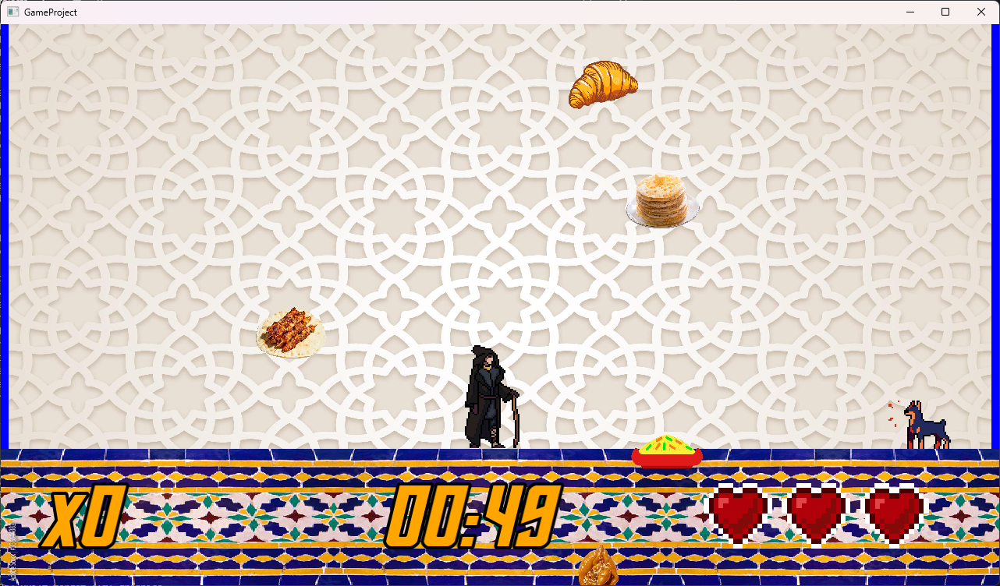

# Moroccan Culture Food Collector

A simple 2D game made for a college art & culture class project.

The goal is to collect traditional Moroccan foods to gain points within a 1-minute time limit. Picking up foods from other cultures causes the player to lose hearts. You start with 3 hearts—lose them all, and it’s game over.

## Features

- Character animations
- Sound effects and background music
- Score system
- Heart/life system
- Timer countdown (1 minute)

## Gameplay

- Move around the screen to collect Moroccan food.
- Avoid non-Moroccan food or you'll lose a heart.
- Try to get the highest score before time runs out or you run out of hearts.

## Controls

- A D, to move left or right.
- Hold SHIFT to run.
- R to Reset game.
- ESC to pause.

## Built With

- [SFML](https://www.sfml-dev.org/) (2.6.x)
- C++17
- CMake

## Building the Game

### Prerequisites

- C++17 compiler (e.g. g++, clang++, MSVC)
- CMake 3.28 or newer
- Git
- SFML is automatically downloaded via CMake

### Build Instructions

```bash
git clone https://github.com/stolenusb/morocco-art-culture-game.git
cd morocco-art-culture-game
cmake -B build
cmake --build build
```

- The executable will be in: build/bin/

